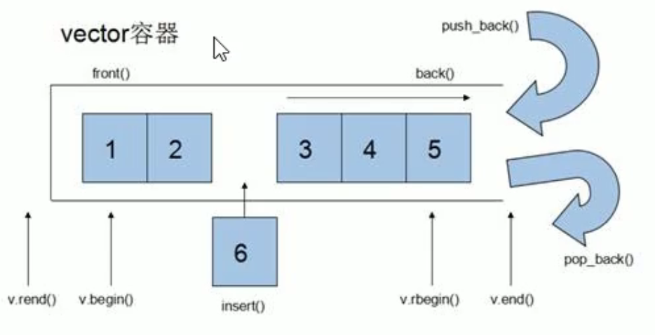
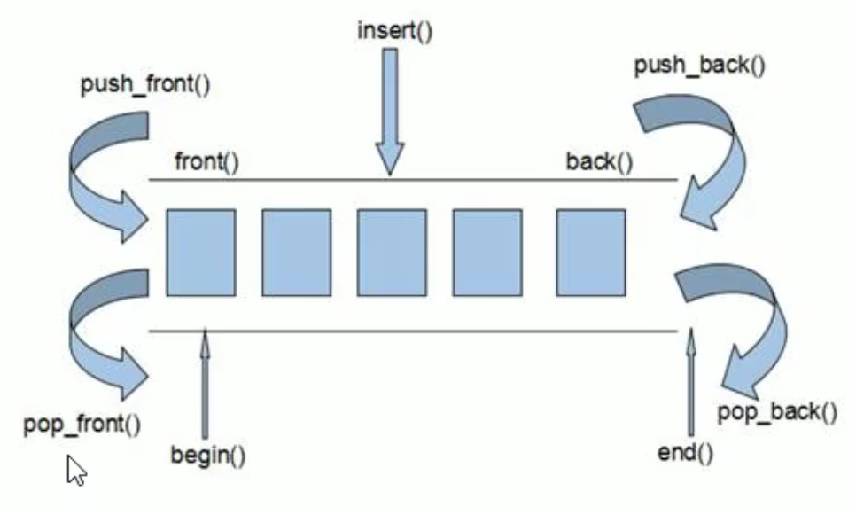
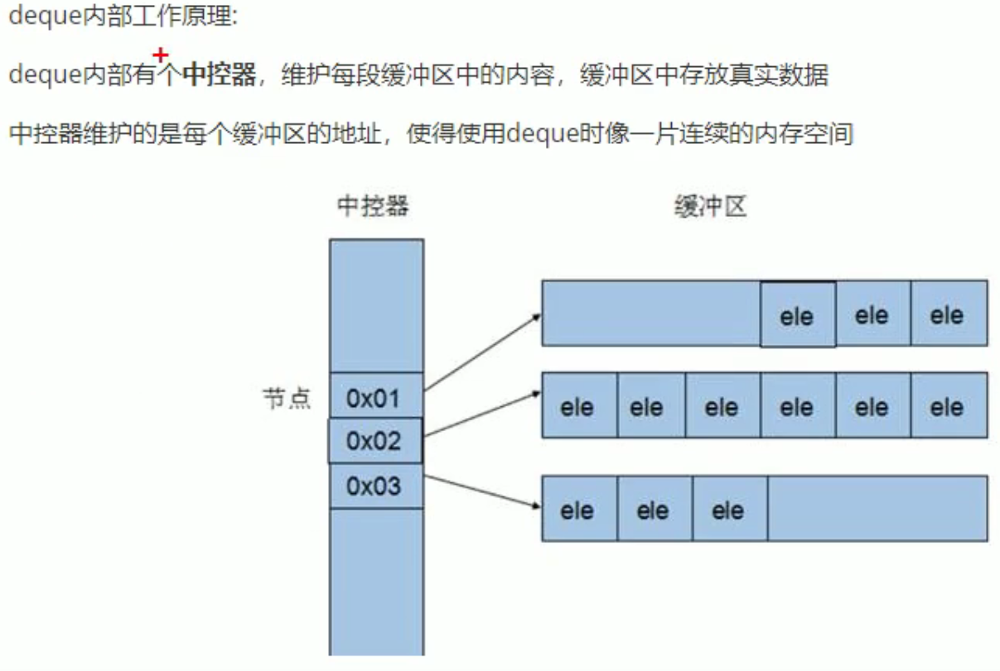
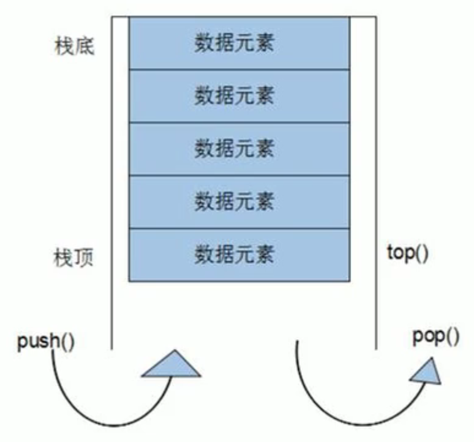
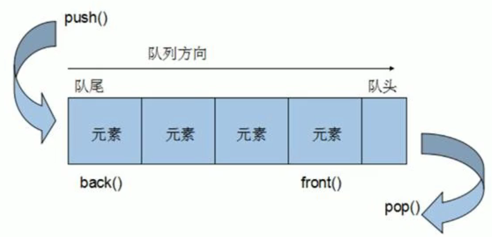
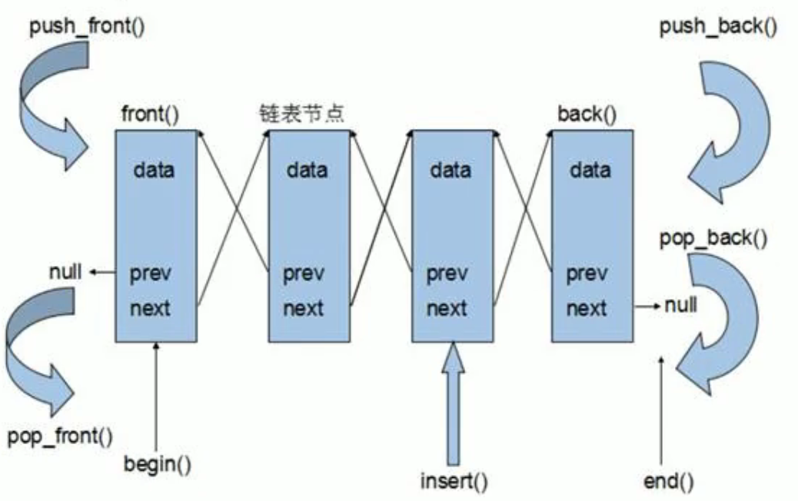

# STL标准模板库

## 基本概念

STL分为6大组件：**容器、算法、迭代器、仿函数、适配器(配接器)、空间配置器**

从广义上分为：**容器(container)**、**算法(algorithm)**、**迭代器(iterator)**，**容器**和**算法**之间通过**迭代器**进行无缝连接

## vector容器

* 功能：类似于数组，也称为**单端数组**

* 与普通数组区别：数组是静态空间，vector可动态扩展（并不是在原空间后直接添加，而是找更大的内存空间，将数据拷贝过去）

  

* 使用：

  ```cpp
  #include <vector>  //头文件
  
  vector<int> v;     //定义一个整型容器
  v.push_back(1);    //在尾端添加一个1
  
  /* 遍历(通过迭代器方式) */
  vector<int>::iterator i;
  
  for (i = num.begin(); i != num.end(); i++)
  {
      cout << *i << endl; //使用*取迭代器中的值
  }
  
  /* 遍历(通过算法方式) */
  void cb_num(int val)
  {
      cout << val <<endl;
  }
  
  for_each(i.begin(), i.end(), cb_num);
  ```


## deque容器

* 功能：双端数组，可对头端进行插入删除操作

  

* 内部工作原理：

  

## stack容器

* 概念：一种先进后出(FILO)的数据结构，只有一个出口

* 栈中只有顶端的元素才可以被外界使用，因此栈不允许有遍历行为

  

## queue容器

* 概念：一种先进先出(FIFO)的数据结构，有两个出口

* 允许从一端新增元素，从另一端移除元素，队列中只有头和尾才可被外界使用，因此不具有遍历行

  

## list容器

* 功能：将数据进行链式存储（双向循环链表）
* 由于链表的存储方式并不是连续的内存空间，因此链表list中的迭代器只支持前移和后移，属于**双向迭代器**



## set/multiset容器

* 概念：所有元素在插入时自动被排序（默认从小到大）

* 本质：属于关联式容器，底层使用二叉树实现

* set和multiset区别：set不允许有重复元素，multiset允许有重复元素

* 改为从大到小排序（使用仿函数）

  ```cpp
  //定义仿函数
  class MyCompare
  {
      public:
      	bool operator()(int v1, int v2)
          {
              return v1 > v2;
          }
  };
  
  //定义set时，指定排序规则
  set<int, MyCompare> s;
  ```
  
  

## pair对组

* 功能：成对出现的数据，利用对组可以返回两个数据

* 使用:

  ```cpp
  //无需引入头文件
  
  /* 定义方式两种 */
  pair<type, type> p (value1, value2);
  pair<type, type> p = make_pair(value1, value2);
  
  //取值，取first和second
  cout << p.first << p.second << endl;
  ```

## map和multimap容器

* 简介
  * map中所有元素都是pair
  * pair中第一个元素为key（键值），起索引作用，第二个元素为value（实值）
  * 所有元素都会根据元素的键值自动排序
* 本质
  * map/multimap属于关联式容器，底层使用二叉树实现
* 优点
  * 可以根据key值快速找到value值
* 区别
  * map不允许有重复key值元素
  * multimap允许有重复key值元素

* 使用

  ```cpp
  #include <map>
  
  map<int, int>m; //定义一个map
  
  /* 四种插入方式 */
  m.insert(pair<int, int>(1, 10));
  m.insert(make_pair(3, 30));
  m.insert(map<int, int>::value_type(4, 40));
  m[2] = 20; //这种方式最好用来访问，不要用来插入
  
  /* 删除 */
  m.erase(m.begin());
  m.erase(3); //按照key删除
  
  /* 查找和统计 */
  m.find(3); //查找key是否存在，存在则返回该元素的迭代器；不存在则返回set.end();
  m.count(3); //统计key的元素个数
  
  /* 排序 */
  //同set容器的方式
  ```

  

## for_each算法

//TODO
