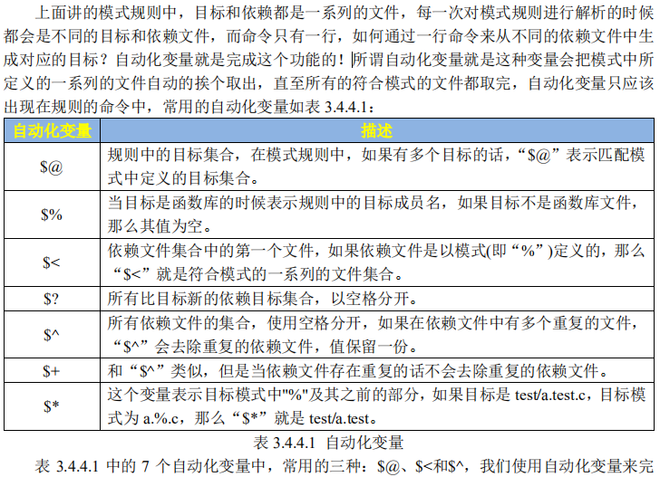

# Makefile

## 编译相关

### 编译流程

GCC编译器的编译流程是:预处理、汇编、编译和链接

* `预处理`就是对程序中的宏定义等相关的内容先进行前期的处理

* `汇编`是先将C文件转换为汇编文件，当C文件转换为汇编文件以后就是文件编译了
* `编译`过程就是将C源文仹编译成.o结尾的目标文件

* `链接`编译生成的.o文仹不能直接执行，而是需要最后的链接，如果你的工程有很多个c源文件的话最终就会有很多.o文件，将这些.o文件链接在一起形成完整的一个可执行文件
* 上一小节演示的例程都只有一个文件，而且文件非常简单，因此可以直接使用gcc命令生
  成可执行文件，并没有先将c文件编译成.o文件，然后在链接在一起

### GCC编译选项

```shell
gcc [选项] [文件名字]
```

**CFLAGS参数：**

* `-c`用于把源码文件编译成.o对象文件，不进行链接过程
* `-o`用于连接生成可执行文件，在其后可以指定输出文件的名称
* `-g`用于在生成的目标可执行文件中，添加调试信息，可以使用GDB进行调试
* `-Idir`用于把新目录添加到 include路径上，可以使用相对和绝对路径："-I"、"-I./include"、"-I/opt/include"
* `-Wall`生成常见的所有告警信息，且停止编译，具体是哪些告警信息，请参见GCC手册，一般用这个足矣!
* `-w`关闭所有告警信息
* `-O`表示编译优化选项，其后可跟优化等级0\1\2\3，默认是0，不优化
* `-fPIC`用于生成位置无关的代码
* `-v`(在标准错误)显示执行编译阶段的命令，同时显示编译器驱动程序预处理器编译器的版本号

**LDFLAGS选项参数：**

* `-llibrary`链接时在标准搜索目录中寻找库文件，搜索名为 liblibrary.a或 liblibrary.so
* `-Ldir`用于把新目录添加到库搜索路径上可以使用相对和绝对路径："-L"、"-L./include"、"-L/opt/include"
* `-Wl,oponoption`把选项option传递给连接器，如果 option中含有逗号，就在逗号处分割成多个选项
  `-static`使用静态库链接生成目标文件，避免使用共享库，生成目标文件会比使用动态链接库大

## Makefile知识

### 基本规则

```makefile
target … : prerequisites…
	command
	…
	…
#target：目标文件
#prerequisites：依赖文件集合
#command：由prerequisites生成target需要执行的命令
#每行命令必须以TAB开始，不可用空格！
```

### 执行流程

执行make命令时，在当前目录找名字为“Makefile”的文件，在该文件中找到第一个目标文件(target)作为最终的目标文件

### 变量

Makefile的变量是一个字符串，类比于C语言的宏，例：

```makefile
objects = main.o display.o
$(objects) #使用变量
```

### 赋值

使用`=`赋值时，变量可使用定义之后的值；

使用`:=`赋值时，变量不接受定义之后修改的值，只使用之前已经定义的值

使用`?=`赋值时，如果前面没有被赋值，那么使用本次赋值；如果前面已经赋值过，那么使用前面的赋值

变量追加：`+=`

### 模式规则

在模式规则中，至少在规则的目标定义中要包含"%"，否则就是一般规则。目标中"%"表示对文件名的匹配，表示长度任意的非空字符串，例如：%.c表示所有以.c结尾的文件

### 自动化变量



### 伪目标

不代表真正的目标明，声明方式（以clean为例）：

```makefile
.PHONY:clean
clean:
	rm *.0
```

