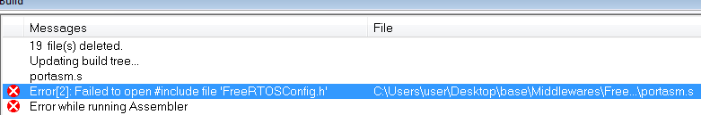
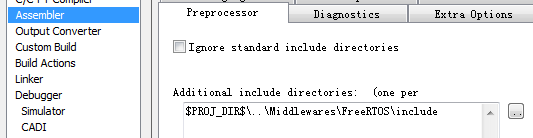

# FreeRTOS的移植

1. 将FreeRTOS源码目录下Source文件夹拷贝到目标工程文件夹下

2. 其中portable文件夹下保留IAR或KEIL(根据编译器选择)和`MemMang`两个文件夹，其他删除

3. IAR文件夹下，根据内核保留对应文件夹

4. 将上述源文件添加至工程

5. 从已有工程拷贝配置文件`FreeRTOSConfig.h`，可能会报如下错误



原因是头文件包含错误，IAR下采用如下方式（注：包含的是`FreeRTOSConfig.h`的目录）：



 

6. 在`stm32f4xx_it.c`中有`PendSV_Handler()`和`SVC_Handler()`函数，需将其注释，采用FreeRTOS实现好的，方法如下

7. freertos接管以下中断（`FreeRTOSConfig.h`文件中）

```c
#define vPortSVCHandler SVC_Handler
#define xPortPendSVHandler PendSV_Handler
#define xPortSysTickHandler SysTick_Handler
```

8. 根据报错包含头文件，需要包含的基本头文件有

```c
#include "FreeRTOS.h"
#include "task.h"
#include "FreeRTOSConfig.h"
```

9. 关闭此宏定义#define configSUPPORT_STATIC_ALLOCATION     0