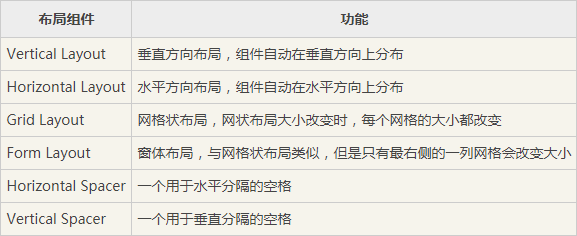
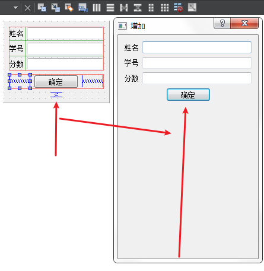

# 布局

## 布局方式说明

## 弹簧的个人理解

弹簧是默认长度，表示两个控件的距离默认有这么长（不准确，因为自动布局后会自动调整长度），最小距离可将弹簧压成最短，最长可以很长，弹簧可以顶着两侧的控件，例如下图效果，加入了弹簧，拉伸窗口时确定键被弹簧顶着

2.分块进行布局，符合基本布局方式的控件进行自动布局，再将每个布局视为整体，多个布局再次布局

3.最后要使用顶层布局（即基本窗口布局），才可使控件大小随窗口变化

参考链接：<https://blog.csdn.net/sinat_36420785/article/details/61432531>